# Linux Задание 1
Cоздадим 3 виртуальные машины Play with docker и присоединим их к локальному терминалу по SSh:
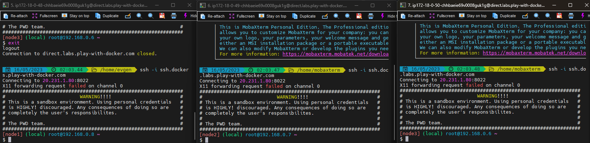

## Настройка виртуальных машин
### Linux A
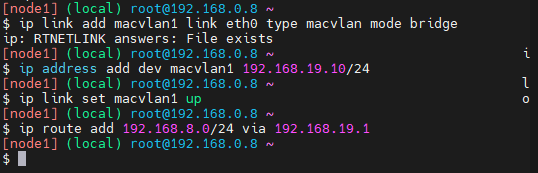
### Linux B
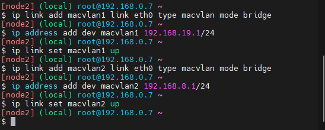
### Linux C
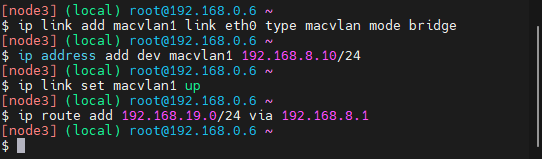
### Веб-сервер Linux A 
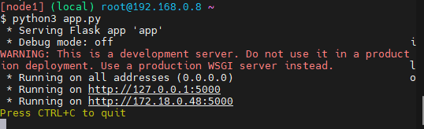
### Веб-клиент Linux С 
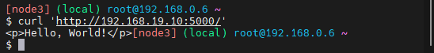
## Проверка 
Что бы проверить работу адаптера отправляем cyrl запрос от веб-клиента к веб-серверу. В результате, мы увидим, что запрос успешно дошел.

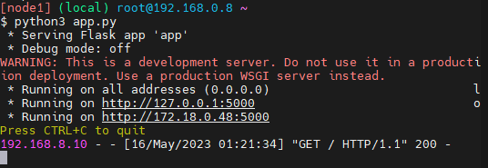

## Bash скрипт
Запустим bash скрипт для каждой виртуальной машины, который повторяет действия сделанные вручную. Для этого создадим заново 3 виртуалки и в результате сurl клиента принимает ответ от сервера из разных подсетей.

После запуска скрипта [LinuxA.sh](configs/LinuxA.sh) на машине А, будет произведена его настройка и сразу же запустится веб-сервер с ожидаем запросов.
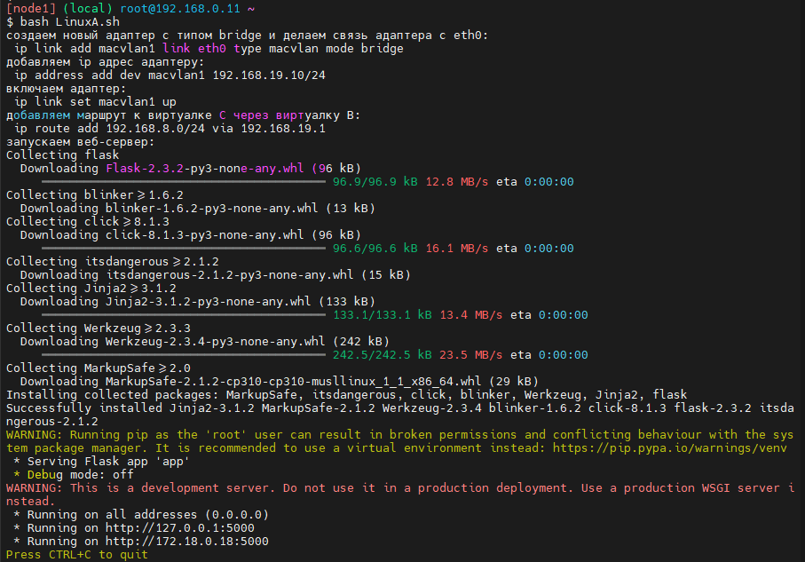

После запуска скрипта [LinuxB.sh](configs/LinuxB.sh) на машине В, появятся новые порты.
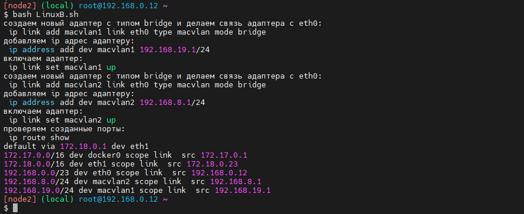

После запуска скрипта [LinuxC.sh](configs/LinuxC.sh) на машине С, будет произведена его настройка и сразу же отправятся GET, PUT и POST запросы на веб-сервер А через шлюз В.

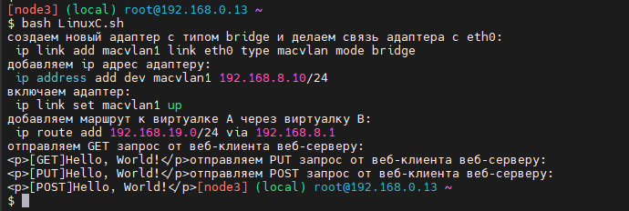

После исполнения последнего скрипта на веб-сервер сразу приходят запросы. Это значит, что шлюз, веб-сервер и веб-клиент работают исправно.

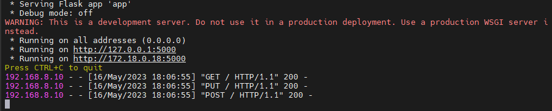

