# Отчёт о практической работе
## Дисциплина: Программное обеспечение облачных платформ<br>Группа: 5142704/30801<br>Преподаватель: Алексеев Антон Павлович<br>Студент: Косов Максим Михайлович

### Описание
Данная практическая работа предназначена для изучения настройки маршрутов пакетов в Linux.

### Подготовка
Для выполнения работы нам понадобится:
* [Oracle VM VirtualBox](https://www.virtualbox.org/wiki/Downloads "Нет денег на нормальную европейскую иномарку, скачай себе Oracle VM VirtualBox и сделай сколько хочешь тачек")
* [Ubuntu Server](https://ubuntu.com/download/server "Тачка, на которую тебе хватает денег")
* Время
* Мозги
* Пальцы (не обязательно)

После получения всех компонентов, необходимых для успешного выполнения задания требуется:
1. Установить Oracle VM VirtualBox (см. отдельные инструкции, для студентов Магистратуры ИКНК)
1. Запустить Oracle VM VirtualBox (см. отдельные инструкции, для студентов Магистратуры ИКНК)
1. После открытия Oracle VM VirtualBox нажать на кнопку "Создать" <p align="center">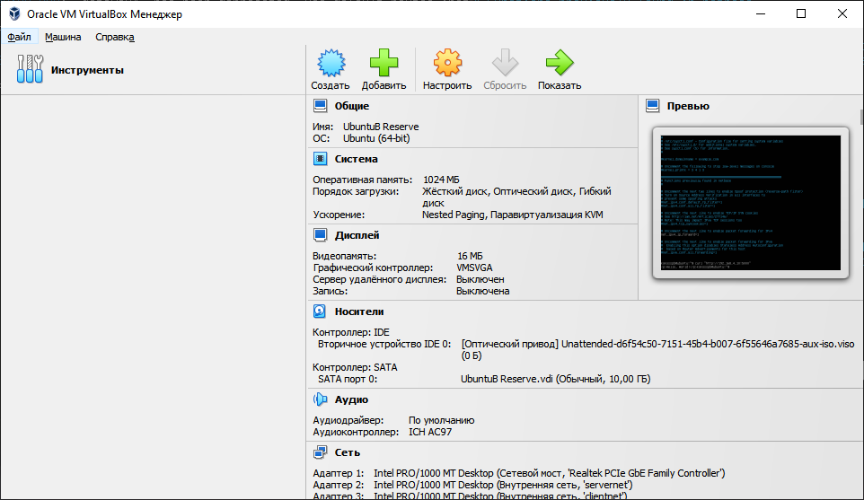</p>
1. В появившемся окне в поле "Имя:" вводим Ubuntu, в поле "Папка:" выбираем, куда будет установлена виртуальная тачка, в поле "Образ ISO:" выбираем наш файл с Ubuntu и нажимаем "Далее" <p align="center">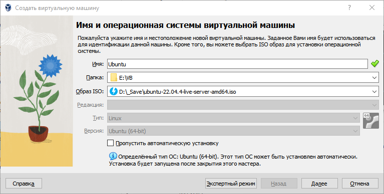</p>
1. Проходим полный цикл установки системы, после чего увидим, что наша новая система появилась в списке <p align="center">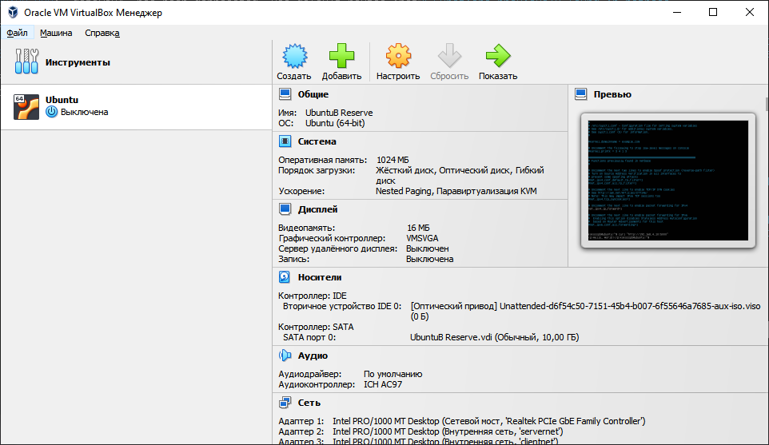</p>
1. Выбираем её одинарным кликом и жмём "Настроить"
1. В появившемся окне "Настройки" выбираем "Сеть" и во вкладке "Адаптер 1", в поле "Тип подключения:" выбираем из выпадающего списка "Сетевой мост"<p align="center">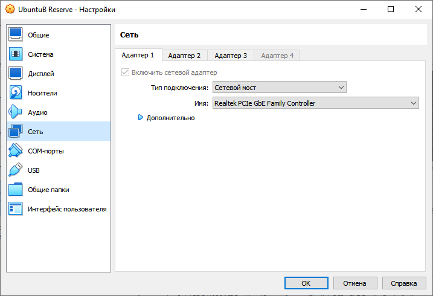</p>
1. Во вкладке "Адаптер 2" ставим галочку, в поле "Тип подключения:" выбираем из выпадающего списка "Внутренняя сеть" и в поле "Имя:" вводим "servernet"<p align="center">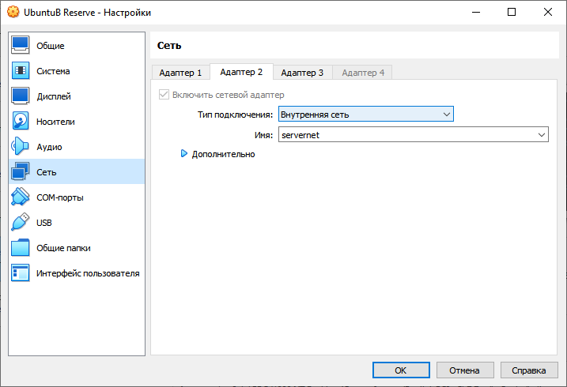</p>
1. Во вкладке "Адаптер 3" ставим галочку, в поле "Тип подключения:" выбираем из выпадающего списка "Внутренняя сеть" и в поле "Имя:" вводим "clientnet"<p align="center">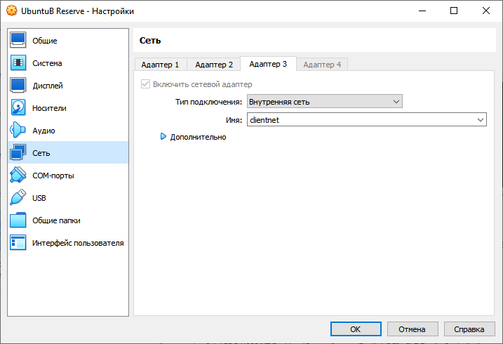</p>
1. Нажимаем "ОК"
Данная тачка будет девственным резервом, на тот случай, если наши пальцы кривые.
### Настройка сервера
1. Делаем клонирование чистой системы. Для этого нажимаем правой кнопкой по нашей девстенной тачке и выбираем "Клонировать"<p align="center">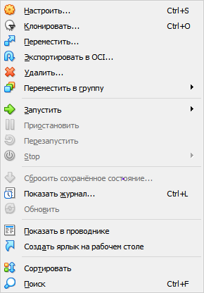</p>
1. В появившемся окне "Клонировать виртуальную машину" в поле "Имя:" пишем "UbunuA", а в поле "Путь:" выбираем, куда будет склонирована виртуальная тачка и жмём "Далее".<p align="center">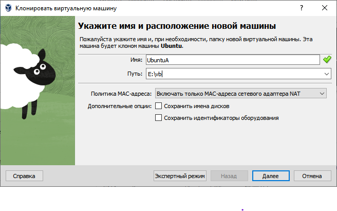</p>
1. После завершения клонирования увидим новую тачку<p align="center">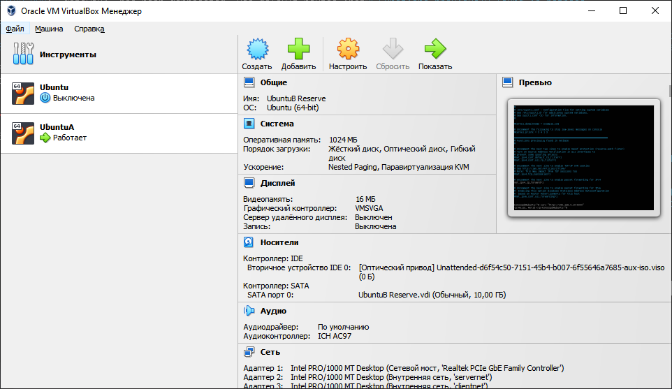</p>
1. Выбираем UbuntuA и жмём "Настроить".
1. В появившемся окне "Настройки" выбираем "Сеть" и во вкладке "Адаптер 3" убираем галочку и жмём "ОК"
1. Выбираем UbuntuA и жмём "Запустить".
1. Дожидаемся загрузки системы.
1. Вводим Имя пользователя и Пароль
1. Вводим <br>```sudo nano /etc/netplan/00-installer-config.yaml```
1. Редактируем содержимое файла так, как показано на рисунке<p align="center">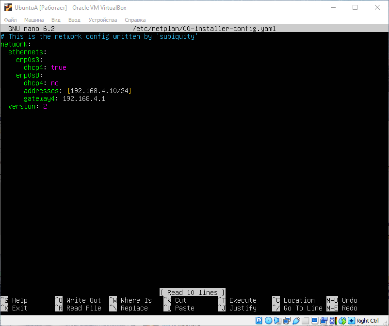</p>
1. Сохраняем файл.
1. Применяем настройки <br>```sudo netplan apply```
1. Вводим <br>```sudo ip route add 192.168.8.0/24 via 192.168.4.1```
1. Обновляем систему <br>```sudo apt-get update`<br>`sudo apt-get apgrade```
1. Устанавливаем Python <br>```sudo apt-get python3```
1. Устанавливаем flask <br>```sudo pip install flask```
1. Создаём файл app.py<br>```sudo nano app.py```
1. Вводим в него следующее содержимое:<br>
```python
from flask import Flask

app = Flask(__name__)

@app.route("/")
def hello_world():
    return "<p>Hello, World!</p>"

app.run(host='192.168.4.10', port=5000)
```<br>
Запускаем приложение<br>```sudo python3 app.py```<p align="center">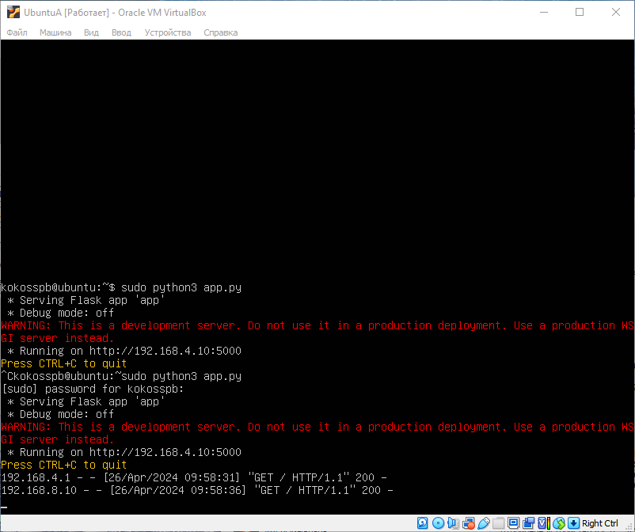</p>
### Настройка роутера
1. Делаем клонирование чистой системы. Для этого нажимаем правой кнопкой по нашей девстенной тачке и выбираем "Клонировать"<p align="center"></p>
1. В появившемся окне "Клонировать виртуальную машину" в поле "Имя:" пишем "UbunuB", а в поле "Путь:" выбираем, куда будет склонирована виртуальная тачка и жмём "Далее".<p align="center"></p>
1. После завершения клонирования увидим новую тачку
1. Выбираем UbuntuB и жмём "Запустить".
1. Дожидаемся загрузки системы.
1. Вводим Имя пользователя и Пароль
1. Вводим <br>```sudo nano /etc/netplan/00-installer-config.yaml```
1. Редактируем содержимое файла так, как показано на рисунке<p align="center">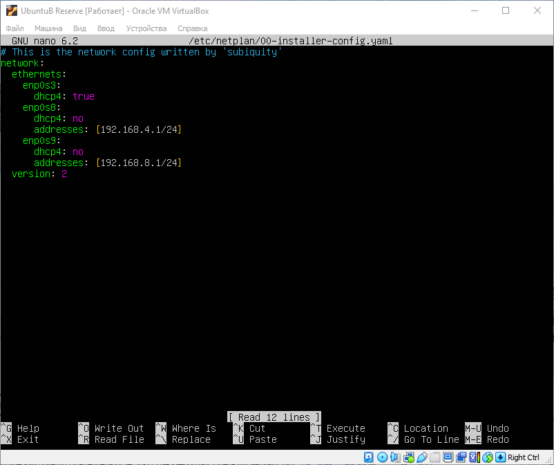</p>
1. Сохраняем файл.
1. Применяем настройки <br>```sudo netplan apply```
1. Разрешаем переброс пакетов ip в нашем gateway<br>```echo 1 | sudo tee /proc/sys/net/ipv4/ip_forward 1```
1. Открываем файл <br>```sudo nano /etc/sysctl.conf```
1. Раскоменчиваем строку с `ip_forward`, как на рисунке<p align="center">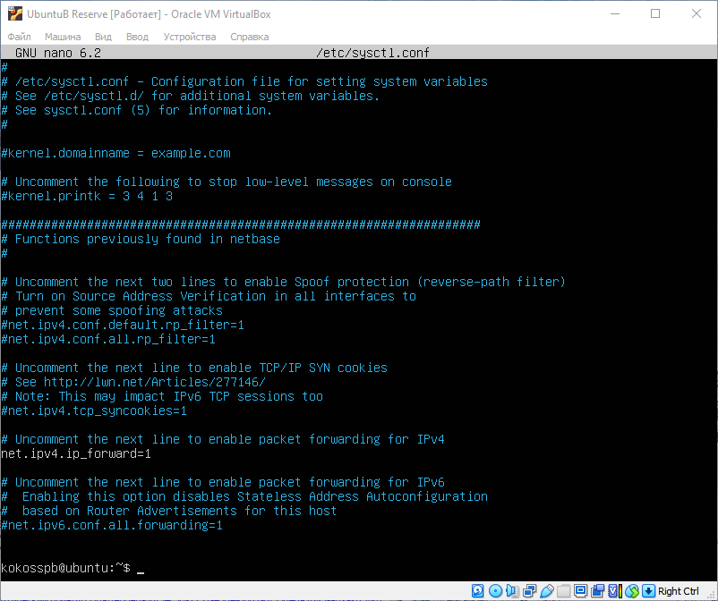</p>
### Настройки клиента
1. Делаем клонирование чистой системы. Для этого нажимаем правой кнопкой по нашей девстенной тачке и выбираем "Клонировать"<p align="center"></p>
1. В появившемся окне "Клонировать виртуальную машину" в поле "Имя:" пишем "UbunuC", а в поле "Путь:" выбираем, куда будет склонирована виртуальная тачка и жмём "Далее".<p align="center"></p>
1. После завершения клонирования увидим новую тачку<p align="center">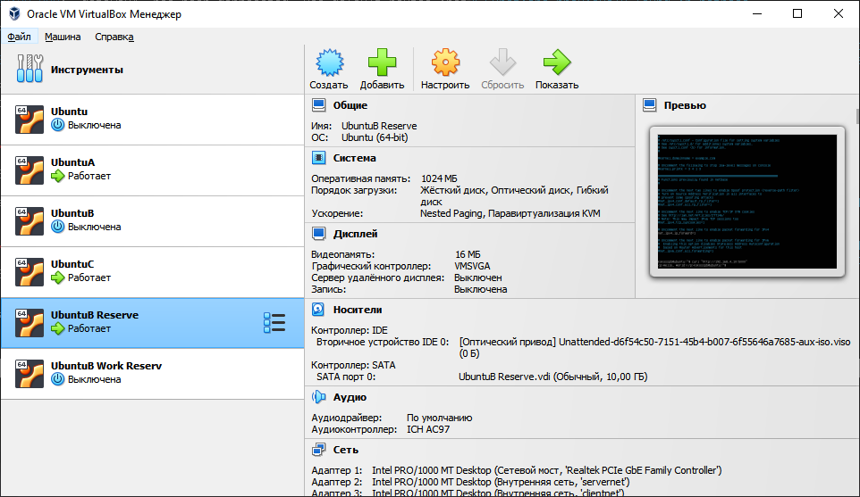</p>
1. Выбираем UbuntuC и жмём "Настроить".
1. В появившемся окне "Настройки" выбираем "Сеть" и во вкладке "Адаптер 2" убираем галочку и жмём "ОК"
1. Выбираем UbuntuC и жмём "Запустить".
1. Дожидаемся загрузки системы.
1. Вводим Имя пользователя и Пароль
1. Вводим <br>```sudo nano /etc/netplan/00-installer-config.yaml```
1. Редактируем содержимое файла так, как показано на рисунке<p align="center">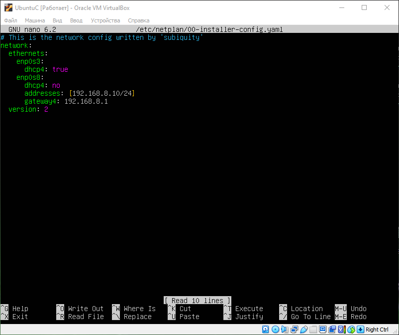</p>
1. Сохраняем файл.
1. Применяем настройки <br>```sudo netplan apply```
1. Вводим <br>```sudo ip route add 192.168.4.0/24 via 192.168.8.1```
1. Вводим <br>```curl "http://192.168.4.10:5000```
1. Видим ответ от тачки не из нашей подсети<p align="center">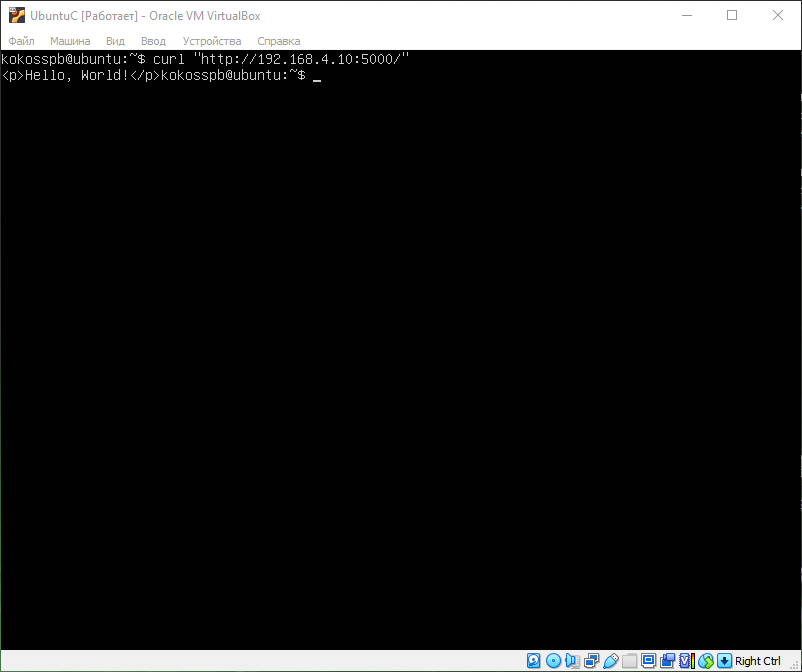</p>