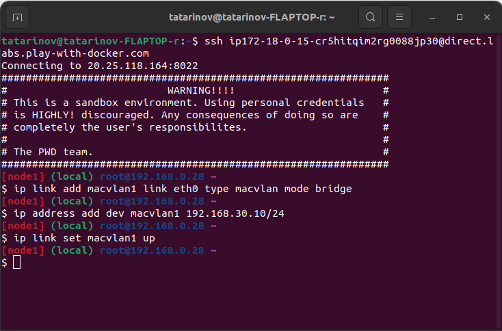

# Отчет по работе с Линуксом

## Создание контейнеров в Play-with-docker

Работа проводилась в среде Play-with-docker.

Сначала добавим три контейнера, нажав кнопку `ADD NEW INSTANCE`.

После добавления контейнеров интерфейс будет выглядеть следующим образом:


Для работы с ними подключимся к каждому контейнеру через терминалы с использованием SSH-соединений.


Теперь настроим сеть с использованием ipvlan. Добавим по одному сетевому адаптеру к каждому из контейнеров A и C:

- ВМ A: IP-адрес 192.168.30.10 с маской 255.255.255.0
- ВМ C: IP-адрес 192.168.7.100 с маской 255.255.255.0  





Также добавляем 2 адаптера контейнеру B:


### Маршрутизация
Теперь настроим маршрутизацию. Укажем контейнеру A отправлять пакеты к контейнеру C через адаптер `macvlan1`, который находится на контейнере B.

- Контейнер A: ip route add 192.168.7.0/24 via 192.168.30.1 

Для контейнера С сделаем наоборот

- Контейнер C: ip route add 192.168.30.0/24 via 192.168.7.1


сделаем пинг


## Создание и запуск сервера

Так как был выбран язык Go для реализации задания то установим его и проверим.

Для этого выполним команды
- apk update
- apk add go 
- 


запустим сервер


Теперь проверим работу GET, POST, PUT запросов.

# Описание сервиса 
### Описание сервиса сокращения URL

Сервис сокращения URL позволяет пользователям преобразовывать длинные URL-адреса в короткие, которые легче запоминать и делиться. Он предоставляет несколько основных функций, включая создание коротких URL, перенаправление на оригинальные URL, отображение всех сокращенных URL и обновление существующих URL.

#### Основные функции:

1. **Сокращение URL**:
    - Метод: `POST`
    - Эндпоинт: `/shorten`
    - Описание: Пользователь отправляет оригинальный URL, и сервис возвращает сокращенный URL. Сокращенный URL имеет формат `http://localhost:8080/{id}`, где `{id}` — уникальный идентификатор, присвоенный оригинальному URL.

2. **Перенаправление на оригинальный URL**:
    - Метод: `GET`
    - Эндпоинт: `/`
    - Описание: При обращении к сокращенному URL (например, `http://localhost:8080/1`), сервис перенаправляет пользователя на оригинальный URL, связанный с этим идентификатором.

3. **Отображение всех сокращенных URL**:
    - Метод: `GET`
    - Эндпоинт: `/map`
    - Описание: Возвращает JSON-объект, содержащий все сокращенные URL и их соответствующие оригинальные URL. Это позволяет пользователям видеть все их сокращенные ссылки.

4. **Обновление существующего URL**:
    - Метод: `PUT`
    - Эндпоинт: `/update/{id}`
    - Описание: Пользователь может обновить оригинальный URL, связанный с определенным идентификатором. Для этого необходимо указать новый URL в теле запроса.

#### Пример использования:
1. **Сокращение URL**:
    - Запрос: `POST /shorten` с телом `url=http://youtube.com`
    - Ответ: `Shortened URL: http://localhost:8080/1`

2. **Перенаправление**:
    - Запрос: `GET /1`
    - Ответ: Перенаправление на `http://youtube.com`

3. **Отображение всех URL**:
    - Запрос: `GET /map`
    - Ответ: `{"1": "http://youtube.com"}`

4. **Обновление URL**:
    - Запрос: `PUT /update/1` с телом `url=https://github.com/play-with-docker/play-with-docker/issues/159`
    - Ответ: `Updated URL for 1 to https://github.com/play-with-docker/play-with-docker/issues/159`

# Проделаем все шаги на контейнерах

# 1. Post 


```ssh
curl -X POST http://192.168.30.10:8080/shorten -d "url=http://youtube.com"
```
Создадим в мапе новое значение с скоращенной ссылкой

# 2. Get

```ssh
curl -L http://192.168.30.10:8080/2
```


Возвращает страцу которая ранее была добавлена в мапу

```ssh
curl  http://192.168.30.10:8080/map
```

Возвращает все сохраненные ссылки 


# 3. Put

```ssh
curl -X PUT http://192.168.30.10:8080/update/2 -d "url=http://vk.com"
```
Обновим существующее значение в мапе 

