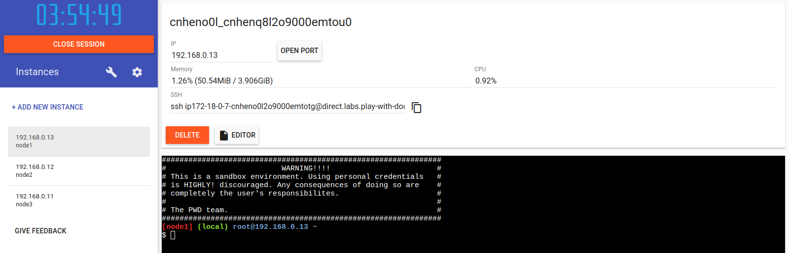
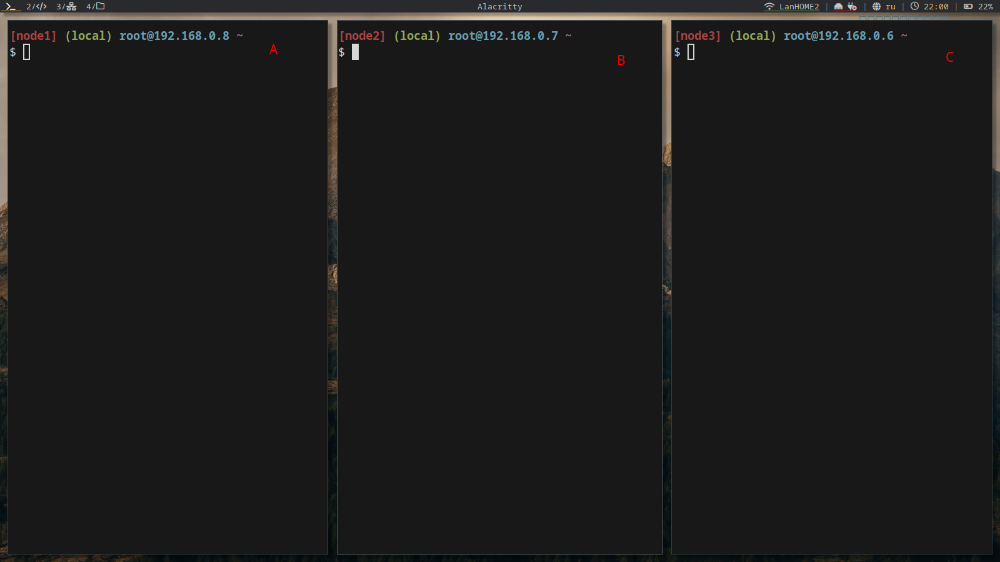
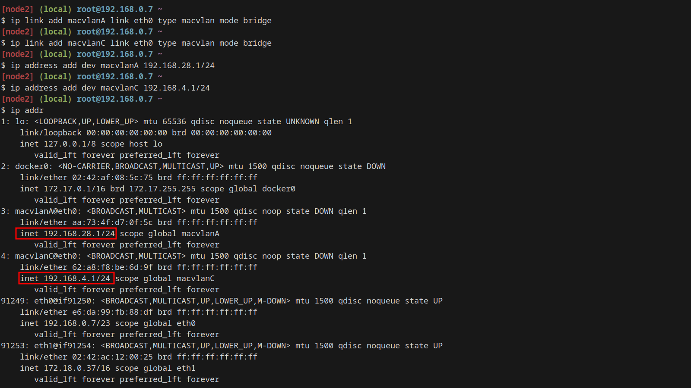
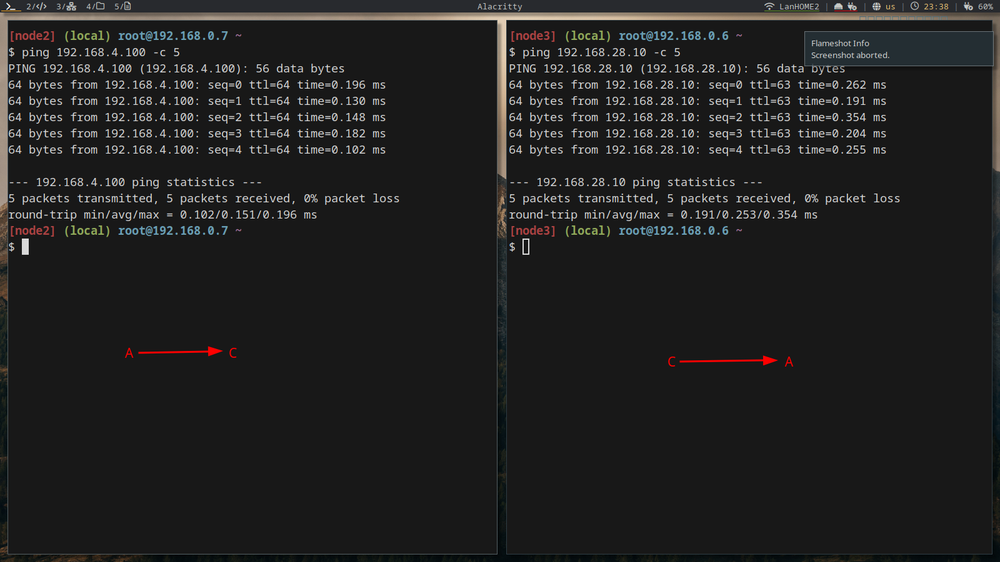

# Создание виртуальных машин

Виртуальные машины были созданы в PlayWithDocker

Добавление новой виртуальной машины происходит при нажатии `ADD NEW INSTANCE`.

Добавим 3 виртуальные машины (см. рис. 1)

Рисунок 1 - Виртуальные машины в Play-With-Docker

Подключимся к ним из своего терминала с использованием ssh соединения (см. рис. 2)

Рисунок 2 - Подключение к ВМ через терминал

Добавим и сконфигурируем адаптеры для машин A и C:
    
* Машина A
    * 192.168.28.10 с маской 255.255.255.0
* Машина C
    * 192.168.4.100 с маской 255.255.255.0

Рисунок 3 - Адаптеры машин A и C

Также добавляем 2 адаптера машине B:

* 192.168.28.1 с маской 255.255.255.0
* 192.168.4.1 с маской 255.255.255.0

Рисунок 4 - Адаптер машины B

## Маршрутизация

Настроим маршруты. Укажем на машине A отсылать пакеты на машину C через адаптер `macvlanA` на машине B и наоборот для машины C:
* Машина A: `ip route add 192.168.4.0/24 via 192.168.28.1`
* Машина C: `ip route add 192.168.28.0/24 via 192.168.4.1`

И машины успешно пингуются :)

Рисунок 4 - Пинг между машинами в разных подсетях

