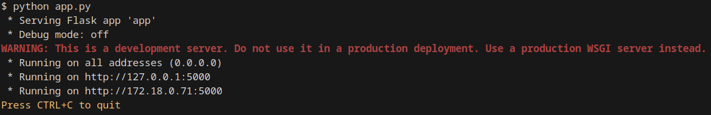
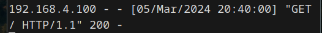
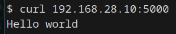

# Создание виртуальных машин

Виртуальные машины были созданы в PlayWithDocker

Добавление новой виртуальной машины происходит при нажатии `ADD NEW INSTANCE`.

Добавим 3 виртуальные машины (см. рис. 1)

<p align="center">

Рисунок 1 - Виртуальные машины в Play-With-Docker
</p>

Подключимся к ним из своего терминала с использованием ssh соединения (см. рис. 2)

<p align="center">

Рисунок 2 - Подключение к ВМ через терминал
</p>

Добавим и сконфигурируем адаптеры для машин A и C:
    
* Машина A
    * 192.168.28.10 с маской 255.255.255.0
* Машина C
    * 192.168.4.100 с маской 255.255.255.0

<p align="center">

Рисунок 3 - Адаптеры машин A и C
</p>


Также добавляем 2 адаптера машине B:

* 192.168.28.1 с маской 255.255.255.0
* 192.168.4.1 с маской 255.255.255.0

<p align="center">

Рисунок 4 - Адаптер машины B
</p>

## Маршрутизация

Настроим маршруты. Укажем на машине A отсылать пакеты на машину C через адаптер `macvlanA` на машине B и наоборот для машины C:
* Машина A: `ip route add 192.168.4.0/24 via 192.168.28.1`
* Машина C: `ip route add 192.168.28.0/24 via 192.168.4.1`

И машины успешно пингуются :)

<p align="center">

Рисунок 4 - Пинг между машинами в разных подсетях
</p>

## Запуск сервера

На машине A развернем сервер на Flask.
Для этого установим `Flask` через `pip` (см. рис. 5).

<p align="center">

Рисунок 5 - Установка Flask
</p>

Напишем сервер на Python:
```
from flask import Flask

app = Flask(__name__)

@app.route("/")
def hello_world():
    return "<p>Hello, World!</p>"

app.run(host='0.0.0.0', port=5000)
```
И запустим его:

<p align="center">

Рисунок 6 - Запуск Flask сервера
</p>

С машины C выполним `/get` запрос через `curl`:
```
curl 192.168.28.10:5000
```

<p align="center">

Рисунок 7 - Логи запросов от клиента на сервере
</p>


<p align="center">

Рисунок 8 - Ответ от сервера у клиента
</p>

## Скрипты

Для упрощения повторения всей изложенной выше работы напишем скрипты для каждой из машин:

### Linux A

```
#!/bin/bash
echo "Configuring adapter for subnet A"
ip link add macvlan1 link eth0 type macvlan mode bridge
ip address add dev macvlan1 192.168.28.10/24
ip link set macvlan1 up
ip route add 192.168.4.0/24 via 192.168.28.1

pip install flask

touch app.py

cat << EOF > app.py
from flask import Flask

app = Flask(__name__)

@app.route("/")
def hello_world():
    return "<p>Hello, World!</p>"

app.run(host='0.0.0.0', port=5000)
EOF

python app.py
```

### Linux B

```
#!/bin/bash
echo "Configuring adapter for subnet A"
ip link add macvlanA link eth0 type macvlan mode bridge
ip address add dev macvlanA 192.168.28.1/24
ip link set macvlanA up

echo "Configuring adapter for subnet C"
ip link add macvlanC link eth0 type macvlan mode bridge
ip address add dev macvlanC 192.168.4.1/24
ip link set macvlanC up

while ! timeout 1 ping -c 1 -n 192.168.28.10:5000 &> /dev/null
do
    printf "%s\n" "Waiting for server response"
done
curl 'https://192.168.28.10:5000/'
```

### Linux C

```
#!/bin/bash
echo "Configuring adapter for subnet C"
ip link add macvlan1 link eth0 type macvlan mode bridge
ip address add dev macvlan1 192.168.4.100/24
ip link set macvlan1 up
ip route add 192.168.28.0/24 via 192.168.4.1

while ! timeout 1 ping -c 1 -n 192.168.28.10:5000 &> /dev/null
do
    printf "%s\n" "Waiting for server response"
done
curl 'https://192.168.28.10:5000/'
```

Загрузка на виртуальные машины осуществляется через утилиту scp:

* Машина A
`scp vmA.sh <ssh_addr_vmA>:~`
* Машина B
`scp vmB.sh <ssh_addr_vmB>:~`
* Машина C
`scp vmC.sh <ssh_addr_vmC>:~`


## Конец

<p align="center">

</p>