# Отчет по работе с Линуксом

## Создание контейнеров в Play-with-docker

Работа выполнялась в Play-with-docker

Для начала создадим три контейнера. Это можно сделать путём нажатия кнопки `ADD NEW INSTANCE`.

Новодобавленные контейнеры в Play-with-docker выглядят вот так (см. рисунок 1)

<p align="center">
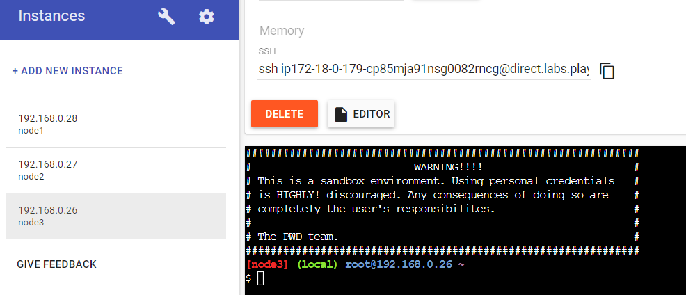
Рисунок 1 - Контейнеры в Play-With-Docker
</p>

Далее настроим сеть при помощи ipvlan. Добавим по одному адаптеру на каждый из контейнеров А и С:
    
* Параметры контейнера A - IP 192.168.20.10 с маской 255.255.255.0 (см. рисунок 2)

<p align="center">
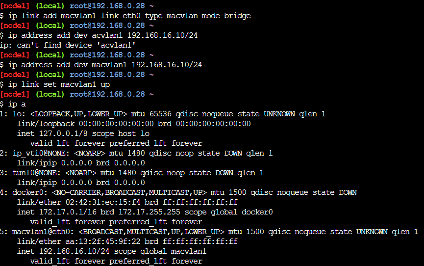
Рисунок 2 - Адаптер контейнер A
</p>

* Параметры контейнера C - 192.168.11.100 с маской 255.255.255.0 (см. рисунок 3)

<p align="center">
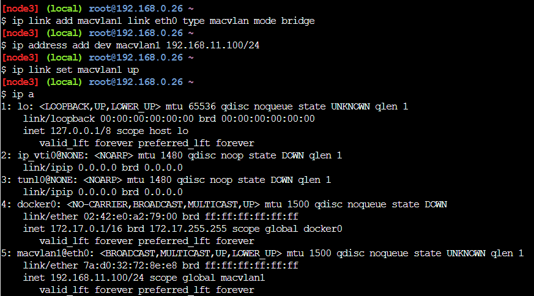
Рисунок 3 - Адаптер контейнер С
</p>


Также добавляем 2 адаптера контейнеру B (см. рисунок 4 и 5):

* 192.168.20.1 с маской 255.255.255.0
* 192.168.11.1 с маской 255.255.255.0

<p align="center">
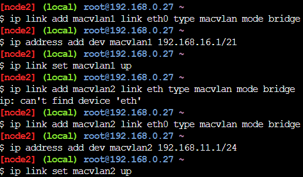
Рисунок 4 - Адаптер контейнер B
</p>

<p align="center">
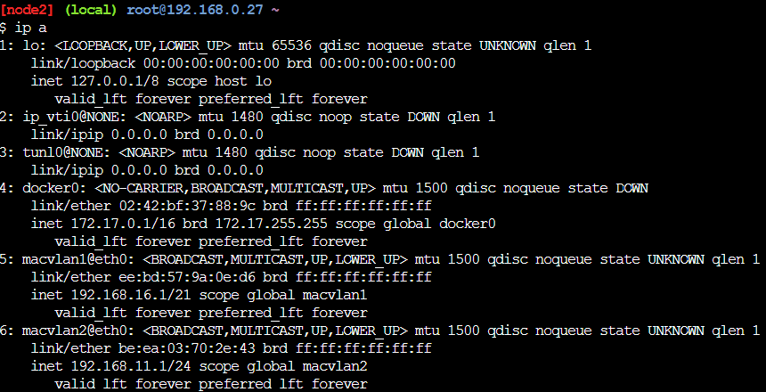
Рисунок 5 - Адаптер контейнер B
</p>

## Маршрутизация

Теперь настроим маршруты.
Укажем на контейнере A отсылать пакеты на контейнер C через адаптер `macvlan1` на контейнере B.

* Контейнер A: `ip route add 192.168.11.0/24 via 192.168.20.1`

Проверим маршрут, пропинговав с А в С (см. рисунок 6)

<p align="center">
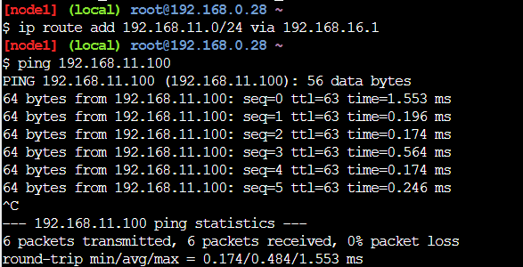
Рисунок 6 - Пинг с контейнера А в С
</p>
  
Теперь укажем на контейнере С отсылать пакеты на контейнер А через адаптер `macvlan2` на контейнере B.

* Машина C: `ip route add 192.168.20.0/24 via 192.168.11.1`

Опять пропингуем(см. рисунок 7):

<p align="center">
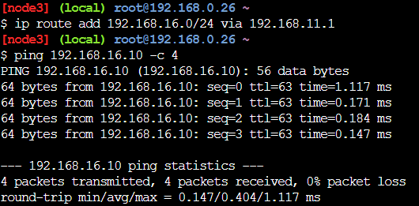
Рисунок 7 - Пинг с контейнера С в А
</p>

## Создание и запуск сервера

На контейнере A развернем сервер на Flask.
Для начала установим `Flask` через `pip`:
```
pip install Flask
```

<p align="center">
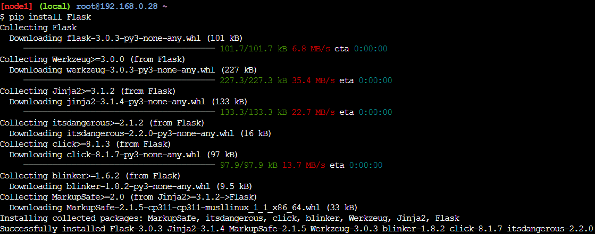
Рисунок 8 - Установка Flask
</p>

Напишем сервер на Python:

```python
from flask import Flask, request

app = Flask(__name__)

@app.route("/")
def get_():
    return f"Hello, world!\n"

@app.route("/", methods = ['POST'])
def post_():
    message = request.args.get('message')
    return f"Message received: {message}\n"

@app.route("/", methods = ['PUT'])
def put_():
    res = f"{request.args.get('message')} - by PUT\n"
    return res

app.run(host='0.0.0.0', port=5000)
```

Теперь запустим его (см. рисунок 9)

<p align="center">
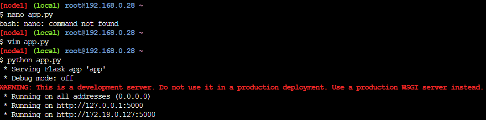
Рисунок 9 - Запуск Flask сервера
</p>

Теперь проверим работу GET, POST, PUT запросов.
С контейнера C выполним `/get` запрос через `curl` (см. рисунок 10):
```
curl 192.168.20.10:5000
```

<p align="center">
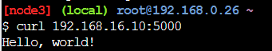
Рисунок 10 - Проверка работы GET запроса
</p>

Посмотрим также логи запроса на сервере (см. рисунок 11).

<p align="center">
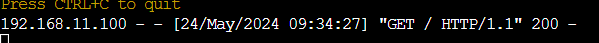
Рисунок 11 - Логи GET запроса
</p>

С контейнера C выполним `/post` и '/put' запросы через `curl` (см. рисунок 12):
```
curl -X POST http://192.168.20.10:5000?sent=modern
```

<p align="center">
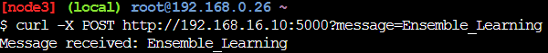
Рисунок 12 - Проверка работы POST запроса
</p>

Посмотрим также логи запросов на сервере (см. рисунок 13).

<p align="center">
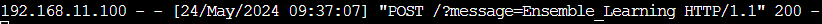
Рисунок 13 - Логи POST запроса
</p>

```
curl -X PUT http://192.168.20.10:5000?sent=modern
```

<p align="center">
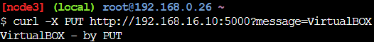
Рисунок 14 - Проверка работы PUT запроса
</p>

<p align="center">

Рисунок 15 - Логи PUT запроса
</p>

## Скрипты

Для автоматического выполнения предыдущих этапов напишем скрипты конфигурации для каждого из контейнеров:

Скрипт для контейнера A

```sh
#!/bin/bash
echo "Starting configuration for instance A"
ip link add macvlan1 link eth0 type macvlan mode bridge
ip address add dev macvlan1 192.168.16.10/24
ip link set macvlan1 up
echo "Configuration ended"

echo "Routing between A and C"
ip route add 192.168.11.0/24 via 192.168.16.1

echo "Installation of FLASK"
pip install flask

echo "Creating web-server"
touch app.py

cat << EOF > app.py
from flask import Flask, request

app = Flask(__name__)

@app.route("/")
def get_():
    return f"Hello, world!\n"

@app.route("/", methods = ['POST'])
def post_():
    message = request.args.get('message')
    return f"Message received: {message}\n"

@app.route("/", methods = ['PUT'])
def put_():
    res = f"{request.args.get('message')} - by PUT\n"
    return res

app.run(host='0.0.0.0', port=5000)
EOF

echo "Run server"
python app.py
```

Скрипт для контейнера B

```sh
#!/bin/bash
echo "Configuring adapter for subnet A"
ip link add macvlan1 link eth0 type macvlan mode bridge
ip address add dev macvlan1 192.168.16.1/24
ip link set macvlan1 up
echo "Configuration ended"

echo "Configuring adapter for subnet C"
ip link add macvlan2 link eth0 type macvlan mode bridge
ip address add dev macvlan2 192.168.11.1/24
ip link set macvlan2 up
echo "Configuration ended"
```

Скрипт для контейнера C

```sh
#!/bin/bash
echo "Starting configuration for instance C"
ip link add macvlan1 link eth0 type macvlan mode bridge
ip address add dev macvlan1 192.168.11.100/24
ip link set macvlan1 up
echo "Configuration ended"

echo "Routing between C and A"
ip route add 192.168.16.0/24 via 192.168.11.1

echo "GET-request"
curl "http://192.168.16.10:5000/"

echo "POST-request"
curl -X POST "http://192.168.16.10:5000?message=Ensemble_Learning"

echo "PUT-request"
curl -X PUT "http://192.168.16.10:5000?message=VirtualBOX"
```
