# Отчет по работе с Линуксом

## Создание контейнеров в Play-with-docker

Работа производилась в Play-with-docker.

Для начала создадим три контейнера при помощи нажатия кнопки `ADD NEW INSTANCE`.

После добавления всё выглядит так (рисунок 1)

<p align="center">
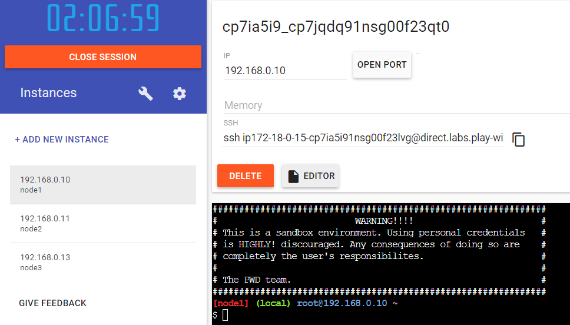
Рисунок 1 - Контейнеры в Play-With-Docker
</p>

Для работы с ними подключимся к ним через терминалы по ssh соединения (рисунок 2)

<p align="center">
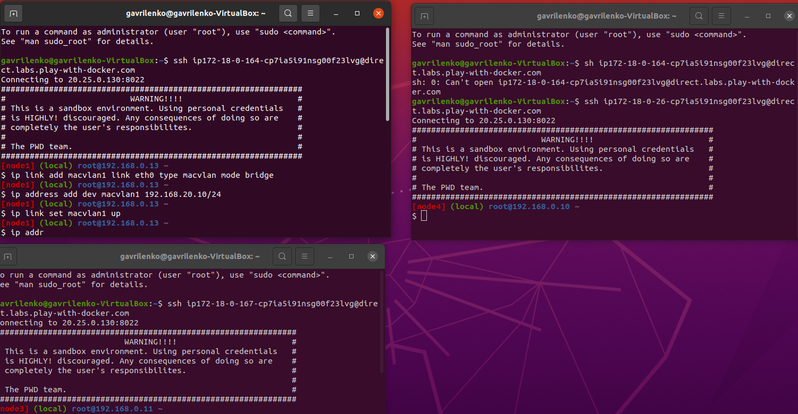
Рисунок 2 - Подключение через терминал в ubuntu
</p>

Далее настроим сеть при помощи ipvlan. Добавим по одному адаптеру на каждый из контейнеров А и С:
    
* ВМ A - IP 192.168.20.10 с маской 255.255.255.0 (рисунок 3)
* ВМ C - 192.168.11.100 с маской 255.255.255.0

<p align="center">
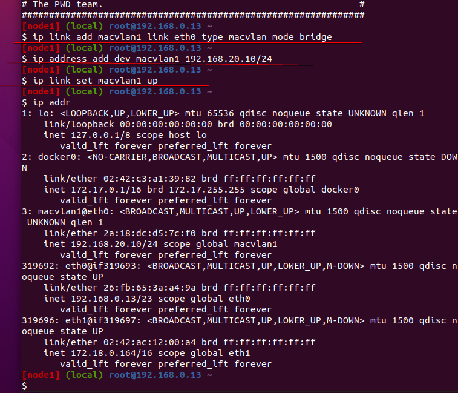
Рисунок 3 - Адаптер контейнер A
</p>

<p align="center">
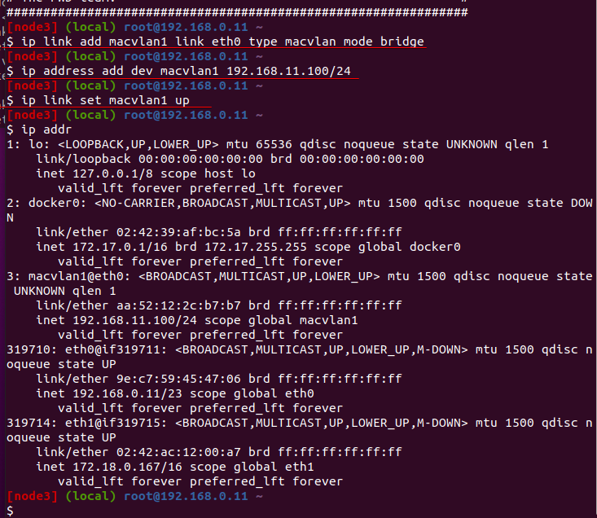
Рисунок 4 - Адаптер контейнер С
</p>


Также добавляем 2 адаптера контейнеру B:

* 192.168.20.1 с маской 255.255.255.0
* 192.168.11.1 с маской 255.255.255.0

<p align="center">
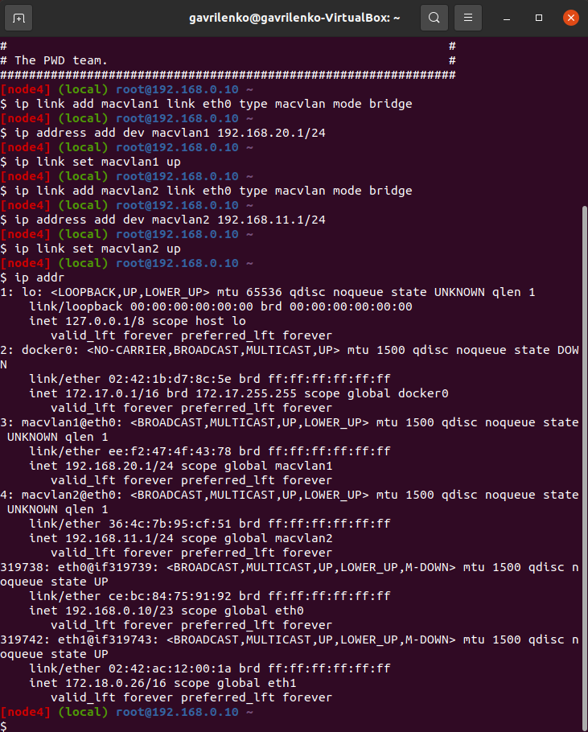
Рисунок 5 - Адаптер контейнер B
</p>

## Маршрутизация

Теперь настроим маршруты.
Укажем на контейнере A отсылать пакеты на контейнер C через адаптер `macvlan1` на контейнере B.

* Контейнер A: `ip route add 192.168.11.0/24 via 192.168.20.1`

<p align="center">
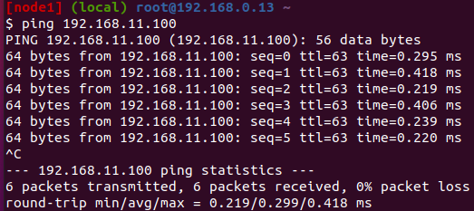
Рисунок 6 - Пинг с контейнера А в С
</p>
  
Для контейнера С поступим наоборот:

* Машина C: `ip route add 192.168.20.0/24 via 192.168.11.1`

<p align="center">
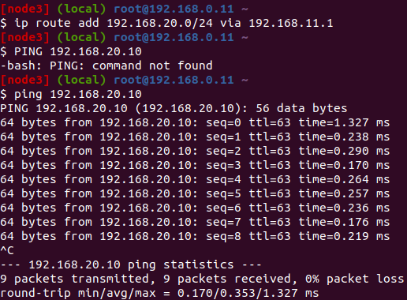
Рисунок 7 - Пинг с контейнера С в А
</p>

## Создание и запуск сервера

На контейнере A развернем сервер на Flask.
Для начала установим `Flask` через `pip`:
```
pip install Flask
```

Напишем сервер на Python (рисунок 8):

<p align="center">
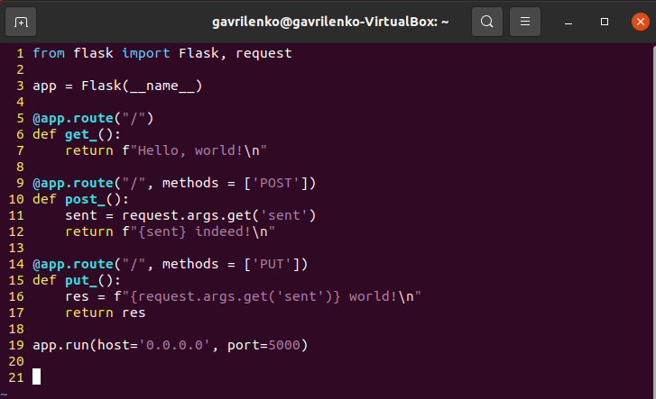
Рисунок 8 - Код сервера
</p>

Теперь запустим его (рисунок 9)

<p align="center">
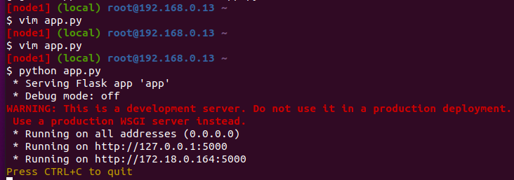
Рисунок 9 - Запуск Flask сервера
</p>

Теперь проверим работу GET, POST, PUT запросов.
С контейнера C выполним `/get` запрос через `curl` (рисунок 10, 2):
```
curl 192.168.20.10:5000
```
Посмотрим также логи запроса на сервере (рисунок 10, 1).

<p align="center">
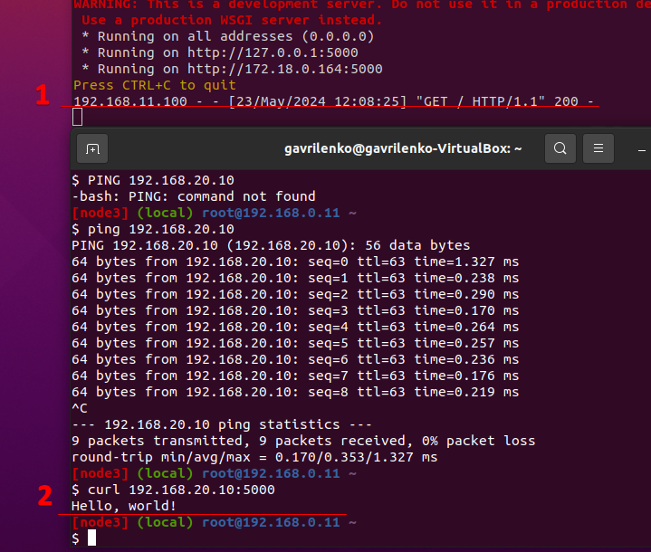
Рисунок 10 - Проверка работы GET запроса
</p>

С контейнера C выполним `/post` и '/put' запросы через `curl` (рисунок 11, 2):
```
curl -X POST http://192.168.20.10:5000?sent=modern
curl -X PUT http://192.168.20.10:5000?sent=modern
```
Посмотрим также логи запросов на сервере (рисунок 11, 1).

<p align="center">
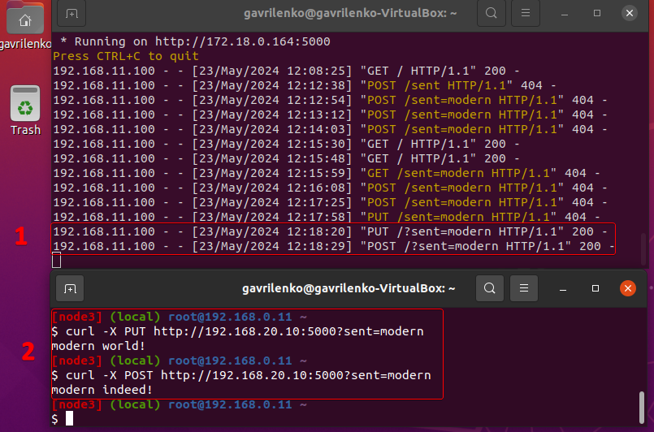
Рисунок 11 - Проверка работы PUT и POST запросов
</p>

## Скрипты

Для автоматического выполнения предыдущих этапов напишем скрипты конфигурации для каждого из контейнеров:

Скрипт для контейнера A

```sh
#!/bin/bash
echo "Configuring adapter for VM A"
ip link add macvlan1 link eth0 type macvlan mode bridge
ip address add dev macvlan1 192.168.20.10/24
ip link set macvlan1 up
echo "Configuration ended"
echo "Routing VM A to VM C"
ip route add 192.168.11.0/24 via 192.168.20.1

echo "Installation of FLASK"
pip install flask

echo "Creating web-server"
touch app.py

cat << EOF > app.py
from flask import Flask, request

app = Flask(__name__)

@app.route("/")
def get_():
    return f"Hello, world!\n"

@app.route("/", methods = ['POST'])
def post_():
    sent = request.args.get('sent')
    return f"{sent} indeed!\n"

@app.route("/", methods = ['PUT'])
def put_():
    res = f"{request.args.get('sent')} world!\n"
    return res

app.run(host='0.0.0.0', port=5000)
EOF

echo "Run server"
python app.py
```

Скрипт для контейнера B

```sh
#!/bin/bash
echo "Configuring adapter for subnet A"
ip link add macvlan1 link eth0 type macvlan mode bridge
ip address add dev macvlan1 192.168.20.1/24
ip link set macvlan1 up
echo "Configuration ended"

echo "Configuring adapter for subnet C"
ip link add macvlan2 link eth0 type macvlan mode bridge
ip address add dev macvlan2 192.168.11.1/24
ip link set macvlan2 up
echo "Configuration ended"
```

Скрипт для контейнера C

```sh
#!/bin/bash
echo "Configuring adapter for VM C"
ip link add macvlan1 link eth0 type macvlan mode bridge
ip address add dev macvlan1 192.168.11.100/24
ip link set macvlan1 up
echo "Configuration ended"
echo "Routing VM C to VM A"
ip route add 192.168.20.0/24 via 192.168.11.1

echo "GET-request"
curl "http://192.168.20.10:5000/"

echo "POST-request"
curl -X POST "http://192.168.20.10:5000?sent=modern"

echo "PUT-request"
curl -X PUT "http://192.168.20.10:5000?sent=very modern"
```
