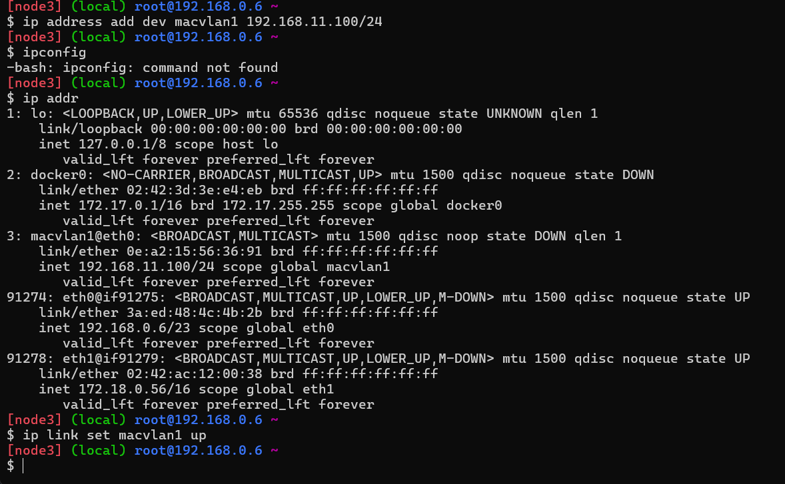

## Шаг 1: создание виртуальных машин в PWD

С помощью возможностей `https://labs.play-with-docker.com/` создаем три виртуальные машины при помощи нажатия `ADD NEW INSTANCE`(см. рис. 1).

<p align="center">

</p>

<p align="center">
  Рисунок 1 - Три виртуальные машины в Play With Docker
</p>

## Шаг 2: генерация SSH-ключа
Для подключения к виртуальным машинам по ssh необходимо сгененрировать ключ (см. рис. 2).
 
<p align="center">

</p>

<p align="center">
  Рисунок 2 - Генерация ключа ssh протоколом ed25519
</p>

Подключение к виртуальным машинам происходит по командам, указанным для каждой ВМ в PWD:

1. `ssh ip172-18-0-40-cnibn7q91nsg00b8iieg@direct.labs.play-with-docker.com`
2. `ssh ip172-18-0-50-cnibn7q91nsg00b8iieg@direct.labs.play-with-docker.com`
3. `ssh ip172-18-0-56-cnibn7q91nsg00b8iieg@direct.labs.play-with-docker.com`

## Шаг 3: Настройка маршрутов
Согласно схеме, приведенной на рисунке 3, необходимо настроить сеть: 
* у Linux A и Linux C - по 1 адаптеру
* Linux B  - по 2 адаптера 

<p align="center">

</p>

<p align="center">
  Рисунок 3 - Развертка трех ВМ по заданной схеме
</p>

По заданию каждому адаптеру необходимо назначить следующие ip-адреса:
Linux A : `192.168.14.10 / 24` (см. рис. 4)
 
Linux С : `192.168.11.100 / 24` (см. рис. 5)

Linux B_1 : `192.168.14.1 / 24` (см. рис. 6)

Linux B_2 : `192.168.11.1 / 24` (см. рис. 7)

<!-------------------------------------------------------->

<p align="center">

</p>

<p align="center">
  Рисунок 4 - Создание адаптера и установка IP - адреса для Linux A
</p>

<!-------------------------------------------------------->

<p align="center">

</p>

<p align="center">
  Рисунок 5 - Создание адаптера и установка IP - адреса для Linux C
</p>

<!-------------------------------------------------------->

<p align="center">

</p>

<p align="center">
  Рисунок 6 - Создание 1-го адаптера и установка IP - адреса для Linux B 
</p>

<!-------------------------------------------------------->

<p align="center">

</p>

<p align="center">
  Рисунок 7 - Создание 2-го адаптера и установка IP - адреса для Linux B 
</p>

<!-------------------------------------------------------->

 После настройки сети на ВМ необходимо прописать маршруты у клиентов А и С к их подсетям через машину В при помощи команды: `ip route add <subnet A vm>/<mask> via <gateway ip B vm>` (см. рис. 8, 9).

<!-------------------------------------------------------->
<p align="center">

</p>

<p align="center">
  Рисунок 8 - Настройка маршрута передачи от А к С через B 
</p>
<!-------------------------------------------------------->


<!-------------------------------------------------------->
<p align="center">

</p>

<p align="center">
  Рисунок 9 -  Настройка маршрута передачи от C к A через B
</p>
<!-------------------------------------------------------->

## Шаг 3: Организация клиент-серверного взаимодействия между А и С 

После настройки маршрутов необходимо развернуть сервер на тачке А (врржууууух =3 ). Для этого нужно использовать библиотеку Flask (см. рис. 10)

<!-------------------------------------------------------->
<p align="center">

</p>

<p align="center">
  Рисунок 10 - Установка Flask
</p>
<!-------------------------------------------------------->

Далее создаем файл app.py со следующим содержимым:

```py
from flask import Flask

app = Flask(__name__)
#Обработка GET запроса
@app.route("/")
def get_():
    return "Был получен GET запрос\n\n"

#Обработка POST запроса
@app.route("/<number>", methods =['POST'])
def post_(number):
    return f"POST запрос : {number}\n\n"

#Обработка PUT запроса
@app.route("/", methods =['PUT'])
def put():
    return "Был получен PUT запрос\n\n"

app.run(host='0.0.0.0', port=5000)
```
Запущенный сервер выглядит так: 
<!-------------------------------------------------------->
<p align="center">

</p>

<p align="center">
  Рисунок 12 -  Сервер на машине А
</p>
<!-------------------------------------------------------->

<!-------------------------------------------------------->
<p align="center">

</p>

<p align="center">
  Рисунок 12  -  Ответ на отправленные запросы с машины С на А
</p>
<!-------------------------------------------------------->


<!-------------------------------------------------------->
<p align="center">

</p>

<p align="center">
  Рисунок 13 - Запросы, пришедшие на сервер А
</p>
<!-------------------------------------------------------->

Для более упрощения работы с виртуальными машинами напишем три скрипта.

*Скрипт конфигурации виртуальной машины А*
```sh
#!/bin/bash
# Linux A
ip link add macvlan1 link eth0 type macvlan mode bridge
ip address add dev macvlan1 192.168.14.10/24
ip link set macvlan1 up
ip route add 192.168.11.0/24 via 192.168.14.1

pip install flask

touch app.py
cat << EOF >app.py

from flask import Flask

app = Flask(__name__)

@app.route("/")
def get_():
    return "Был получен GET запрос\n\n"

@app.route("/<number>", methods =['POST'])
def post_(number):
    return f"POST запрос : {number}\n\n"

@app.route("/", methods =['PUT'])
def put():
    return "Был получен PUT запрос\n\n"

app.run(host='0.0.0.0', port=5000)

EOF

python app.py
```
*Скрипт конфигурации виртуальной машины В*
```sh
#!/bin/bash
# Linux B

ip link add macvlan1 link eth0 type macvlan mode bridge
ip address add dev macvlan1 192.168.14.1/24
ip link set macvlan1 up

ip link add macvlan2 link eth0 type macvlan mode bridge
ip addres add dev macvlan2 192.168.11.1/24
ip link set macvlan2 up
```
*Скрипт конфигурации виртуальной машины С*
```sh
#!/bin/bash
# Linux С

ip link add macvlan1 link eth0 type macvlan mode bridge
ip address add dev macvlan1 192.168.11.100/24
ip link set macvlan1 up
ip route add 192.168.14.0/24 via 192.168.11.1

echo "\nОтсылаю запрос GET"
curl "http://192.168.14.10:5000/"

echo "Отсылаю запрос POST"
curl -X POST http://192.168.14.10:5000/14

echo "Отсылаю запрос PUT"
curl -X PUT http://192.168.14.10:5000/ -d "PUT request data"
```

