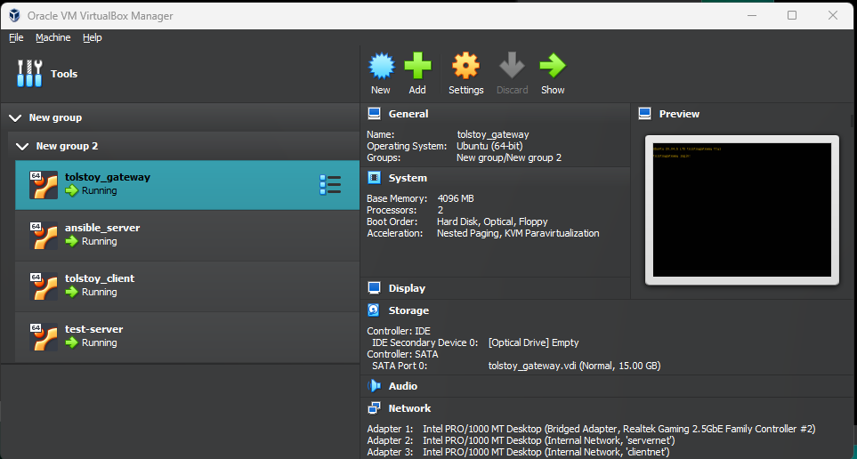

## Разворачиваем 4 виртуальные машины в VBOX



Узнаем ip адрес каждой машины с помощью команды <br>
``` 
ip addr
```
<br>
После чего на одной из разворачиваем ansible server с помощью команды: <br>
``` 
sudo apt update ansible
sudo apt install ansible
```
Далее подключаемся по sftp к нашему ansible server любым удобным способом и конфигурируем рабочую область следующим образом: <br>

 <br>

Сначала создаем inventory файл, в котором хранятся данные обо всех наших хостах: <br>

 <br>

Далее добавляем в основной конфиг данные о расположении inventory и убираем проверку ключей: <br>

 <br>

После чего можем создать папки с нужными файлами настроек для всех виртуальных машин: <br>

 <br>

Далее создаем файл с переменными, где указаны пути для копирования и вставки файлов конфигураций виртуалок(для каждого хоста свой отдельный файл): <br>
 <br>

После чего можно начать работать с playbook: <br>


Для запуска плейбука заходим в директорию в которой он расположен и используем команду: <br>
``` ansible-playbook {имя плейбука} -kK ``` <br>
``` -kK ``` используем для ввода пароля для пароля ssh и пароля прав sudo <br>


Наблюдаем за ходом выполнения плейбука: <br>
 <br>
Далее можем вручную проверить работу скрипта для отправки запросов через шлюз к серверу: <br>

<br>


