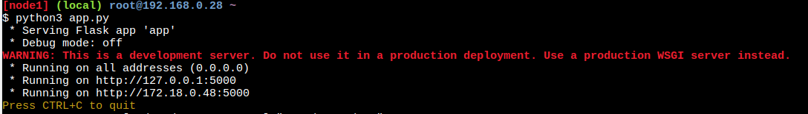

## Linux Practice

Создаем 3 виртуальные машины:
- 192.168.0.26 - Client
- 192.168.0.27 - Gateway
- 192.168.0.28 - Server

Скопируем исполняемые файлы на виртуальные машины

На машине клиента запускаем client.sh

Также запускаем gw.sh

И server.sh

Запустим веб сервер

Для проверки работоспособности отправим запрос с клиента на сервер через шлюз

На каждый http запрос получили ответ

На стороне сервера можем заметить, что было получено 3 запроса

Также проверим как работает функция обработки параметров:

- Если какой-то параметр не был передан или не было вообще будут использованы параметры по умолчанию

