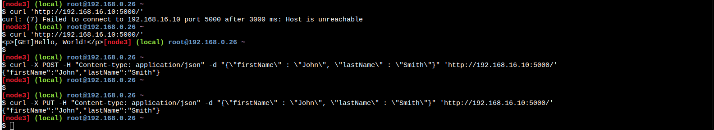

## Linux Practice

Создаем 3 виртуальные машины:
- 192.168.0.26 - Client
- 192.168.0.28 - Gateway
- 192.168.0.28 - Server

Скопируем исполняемые файлы на виртуальные машины

На машине клиента запускаем client.sh

Также запускаем gw.sh

И server.sh

Запустим веб сервер

Для проверки работоспособности отправим запрос с клиента на сервер через шлюз

На каждый http запрос получили ответ

Также на стороне клиента можем заметить, что было получено 3 запроса
