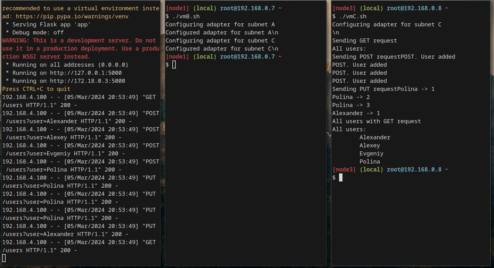

# Отчет
## Создание маршрутов в подсетях 

**Выполнил** Маликов Александр

**Группа** 5142704/30801 

## Создание виртуальных машин

Виртуальные машины были созданы в PlayWithDocker

Добавление новой виртуальной машины происходит при нажатии `ADD NEW INSTANCE`.

Добавим 3 виртуальные машины (см. рис. 1)

<p align="center">

Рисунок 1 - Виртуальные машины в Play-With-Docker
</p>

Подключимся к ним из своего терминала с использованием ssh соединения (см. рис. 2)

<p align="center">

Рисунок 2 - Подключение к ВМ через терминал
</p>

Добавим и сконфигурируем адаптеры для машин A и C:
    
* Машина A
    * 192.168.28.10 с маской 255.255.255.0
* Машина C
    * 192.168.4.100 с маской 255.255.255.0

<p align="center">

Рисунок 3 - Адаптеры машин A и C
</p>


Также добавляем 2 адаптера машине B:

* 192.168.28.1 с маской 255.255.255.0
* 192.168.4.1 с маской 255.255.255.0

<p align="center">

Рисунок 4 - Адаптер машины B
</p>

## Маршрутизация

Настроим маршруты. Укажем на машине A отсылать пакеты на машину C через адаптер `macvlanA` на машине B и наоборот для машины C:
* Машина A: `ip route add 192.168.4.0/24 via 192.168.28.1`
* Машина C: `ip route add 192.168.28.0/24 via 192.168.4.1`

И машины успешно пингуются :)

<p align="center">

Рисунок 5 - Пинг между машинами в разных подсетях
</p>

## Запуск сервера

На машине A развернем сервер на Flask.
Для этого установим `Flask` через `pip` (см. рис. 5).

<p align="center">

Рисунок 6 - Установка Flask
</p>

Напишем сервер на Python хранящий имена людей и *абстрактный* счет для каждого человека:

```py
from flask import Flask, request
app = Flask(__name__)

users = {}

@app.route('/')
def home():
   return "Hello world\n"


@app.route('/users', methods=['POST'])
def post():
   user = request.args.get('user')
   
   if user is None:
      return "Can not add user\n"

   if user not in users:
      users[user] = 0
      return "POST. User added\n"

   return f"POST. User already added\n"


@app.route('/users', methods=['PUT', 'GET'])
def getput():
   user = request.args.get('user')
   
   if request.method == 'GET' and user is None:
      res = "\nAll users:\n"
      for usr in users:
         res += f"\t{usr}\n"
      return res
   
   if user is None:
      return "User undefined\n"
   
   if user not in users:
      return "Can not find user\n"
   
   users[user] += 1

   return f"{user} -> {users[user]}\n"


app.run(host='0.0.0.0', port=5000)
```
И запустим его:

<p align="center">

Рисунок 7 - Запуск Flask сервера
</p>

С машины C выполним `/get` запрос через `curl`:
```
curl 192.168.28.10:5000
```

<p align="center">

Рисунок 8 - Логи запросов от клиента на сервере
</p>


<p align="center">

Рисунок 9 - Ответ от сервера у клиента
</p>

Примеры остальных запросов приведены ниже в разделе `Запуск "с нуля"`.

## Скрипты

Для упрощения повторения всей изложенной выше работы напишем скрипты для каждой из машин:

### Linux A

```sh
#!/bin/bash
echo "Configuring adapter for subnet A"
ip link add macvlan1 link eth0 type macvlan mode bridge
ip address add dev macvlan1 192.168.28.10/24
ip link set macvlan1 up
ip route add 192.168.4.0/24 via 192.168.28.1

pip install flask

touch app.py

cat << EOF > app.py
from flask import Flask, request
app = Flask(__name__)

users = {}

@app.route('/')
def home():
   return "Hello world\n"


@app.route('/users', methods=['POST'])
def post():
   user = request.args.get('user')
   
   if user is None:
      return "Can not add user\n"

   if user not in users:
      users[user] = 0
      return "POST. User added\n"

   return f"POST. User already added\n"


@app.route('/users', methods=['PUT', 'GET'])
def getput():
   user = request.args.get('user')
   
   if request.method == 'GET' and user is None:
      res = "\nAll users:\n"
      for usr in users:
         res += f"\t{usr}\n"
      return res
   
   if user is None:
      return "User undefined\n"
   
   if user not in users:
      return "Can not find user\n"
   
   users[user] += 1

   return f"{user} -> {users[user]}\n"


app.run(host='0.0.0.0', port=5000)
EOF

python app.py
```

### Linux B

```sh
#!/bin/bash
echo "Configuring adapter for subnet A"
ip link add macvlanA link eth0 type macvlan mode bridge
ip address add dev macvlanA 192.168.28.1/24
ip link set macvlanA up
echo "Configured adapter for subnet A\n"

echo "Configuring adapter for subnet C"
ip link add macvlanC link eth0 type macvlan mode bridge
ip address add dev macvlanC 192.168.4.1/24
ip link set macvlanC up
echo "Configured adapter for subnet C\n"
```

### Linux C

```sh
#!/bin/bash
echo "Configuring adapter for subnet C"
ip link add macvlan1 link eth0 type macvlan mode bridge
ip address add dev macvlan1 192.168.4.100/24
ip link set macvlan1 up
ip route add 192.168.28.0/24 via 192.168.4.1

echo "\n"
while ! timeout 1 ping -c 1 -n 192.168.28.10:5000 &> /dev/null
do
    printf "%s\n" "Waiting for server response"
done

printf "Sending %s request" "GET"
curl http://192.168.28.10:5000/users

printf "Sending %s request" "POST"
curl -X POST http://192.168.28.10:5000/users?user=Alexander
curl -X POST http://192.168.28.10:5000/users?user=Alexey
curl -X POST http://192.168.28.10:5000/users?user=Evgeniy
curl -X POST http://192.168.28.10:5000/users?user=Polina

printf "Sending %s request" "PUT"
curl -X PUT http://192.168.28.10:5000/users?user=Polina
curl -X PUT http://192.168.28.10:5000/users?user=Polina
curl -X PUT http://192.168.28.10:5000/users?user=Polina
curl -X PUT http://192.168.28.10:5000/users?user=Alexander

printf "All users with GET request"
curl http://192.168.28.10:5000/users
```

Загрузка на виртуальные машины осуществляется через утилиту scp:

* Машина A
`scp vmA.sh <ssh_addr_vmA>:~`
* Машина B
`scp vmB.sh <ssh_addr_vmB>:~`
* Машина C
`scp vmC.sh <ssh_addr_vmC>:~`

## Запуск "с нуля"
Создав виртаульные машины с нуля загрузим на них скрипты (см. рис. 10) и посмотрим на реакцию (см. рис. 11).

<p align="center">

Рисунок 10 - Новые виртуальные машины
</p>

<p align="center">

Рисунок 11 - Перезапуск систем с нуля
</p>

Как можно видеть при запуске на новых машинах конфигурация происходит "на ура".

Реакция сервера на запросы `GET`, `PUSH`, `PUT` приведены на рисунке 12.

<p align="center">

Рисунок 11 - Результаты на запросы с сервера
</p>

## Конец

<p align="center">

</p>