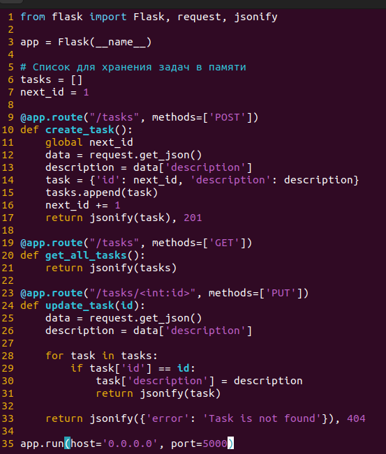

## Отчет по работе с Линуксом

### _1. Создание контейнеров в Play-with-docker_

Работа производилась в Play-with-docker (https://labs.play-with-docker.com/). Сначала создаются три контейнера нажатием кнопки `ADD NEW INSTANCE`.

<p align="center">

Рисунок 1 - Контейнеры в Play-With-Docker
</p>

Далее подключимся к нодам через терминал с помощью ssh соединения:

<p align="center">

Рисунок 2 - Подключение к нодам через терминал в Ubuntu
</p>

Настроим сеть при помощи `ipvlan`. Добавим по одному адаптеру на каждый из контейнеров А и С:

* ВМ A - IP 192.168.29.10 с маской 255.255.255.0
* ВМ C - 192.168.10.100 с маской 255.255.255.0

<p align="center">

Рисунок 3 - Адаптер контейнера A
</p>

<p align="center">

Рисунок 4 - Адаптер контейнера С
</p>


Также контейнеру B добавим 2 адаптера:

* 192.168.29.1 с маской 255.255.255.0
* 192.168.10.1 с маской 255.255.255.0

<p align="center">

Рисунок 5 - Адаптеры контейнера B
</p>

### _2. Маршрутизация_

Настройка маршрутов. Укажем на контейнере A отсылать пакеты на контейнер C через адаптер `macvlan1` на контейнере B.

* Контейнер A: `ip route add 192.168.10.0/24 via 192.168.29.1`

<p align="center">

</p>
<div align="center">Рисунок 6 - Пинг с контейнера A на C</div>

Для контейнера С укажем отсылать пакеты на контейнер А через адаптер `macvlan2` на контейнере B.

* Контейнер C: `ip route add 192.168.29.0/24 via 192.168.10.1`

<p align="center">
    
</p>
<div align="center">Рисунок 7 - Пинг с контейнера С на А</div>

### _3. Создание и запуск сервера_

На контейнере A развернем сервер на Flask. Установим `Flask` через `pip`:
```
pip install Flask
```

Напишем сервер на Python (рисунок 8):

<p align="center">
    
</p>
<div align="center">Рисунок 8 - Код сервера</div>

Теперь запустим его (рисунок 9)

<p align="center">
    
</p>
<div align="center">Рисунок 9 - Запуск Flask сервера</div>

Теперь проверим работу GET, POST, PUT запросов.
С контейнера C выполним запросы через `curl` (рисунок 10):
```
curl 192.168.20.10:5000
```

<p align="center">

Рисунок 10 - Проверка работы GET, POST, PUT запросов
</p>

Посмотрим также логи запросов на сервере (рисунок 11).

<p align="center">

Рисунок 11 - Логи запросов на сервере
</p>

### _4. Скрипты_

Для автоматического выполнения предыдущих этапов напишем скрипты конфигурации для каждого из контейнеров:

Скрипт для контейнера A

```sh
#!/bin/bash
echo "Configuring adapter for VM A"
ip link add macvlan1 link eth0 type macvlan mode bridge
ip address add dev macvlan1 192.168.29.10/24
ip link set macvlan1 up
echo "Configuration ended"
echo "Routing VM A to VM C"
ip route add 192.168.10.0/24 via 192.168.29.1

echo "Installation of FLASK"
pip install flask

echo "Creating web-server"
touch app.py

cat << EOF > app.py
from flask import Flask, request, jsonify

app = Flask(__name__)

# Список для хранения задач в памяти
tasks = []
next_id = 1

@app.route("/tasks", methods=['POST'])
def create_task():
    global next_id
    data = request.get_json()
    description = data['description']
    task = {'id': next_id, 'description': description}
    tasks.append(task)
    next_id += 1
    return jsonify(task), 201

@app.route("/tasks", methods=['GET'])
def get_all_tasks():
    return jsonify(tasks)

@app.route("/tasks/<int:id>", methods=['PUT'])
def update_task(id):
    data = request.get_json()
    description = data['description']

    for task in tasks:
        if task['id'] == id:
            task['description'] = description
            return jsonify(task)

    return jsonify({'error': 'Task is not found'}), 404

app.run(host='0.0.0.0', port=5000)
EOF

echo "Run server"
python app.py
```

Скрипт для контейнера B

```sh
#!/bin/bash
echo "Configuring adapter for subnet A"
ip link add macvlan1 link eth0 type macvlan mode bridge
ip address add dev macvlan1 192.168.29.1/24
ip link set macvlan1 up
echo "Configuration ended"

echo "Configuring adapter for subnet C"
ip link add macvlan2 link eth0 type macvlan mode bridge
ip address add dev macvlan2 192.168.10.1/24
ip link set macvlan2 up
echo "Configuration ended"

```

Скрипт для контейнера C

```sh
#!/bin/bash
echo "Configuring adapter for VM C"
ip link add macvlan1 link eth0 type macvlan mode bridge
ip address add dev macvlan1 192.168.10.100/24
ip link set macvlan1 up
echo "Configuration ended"
echo "Routing VM C to VM A"
ip route add 192.168.29.0/24 via 192.168.10.1

echo "GET-request"
curl "http://192.168.29.10:5000/tasks"

echo "POST-request"
curl -X POST "http://192.168.29.10:5000/tasks -H 'Content-Type: application/json' -d '{'description': 'My first task'}'"

echo "PUT-request"
curl -X PUT "http://192.168.29.10:5000/tasks/1 -H 'Content-Type: application/json' -d '{'description': 'Updated task description'}'"
```
