## Шаг 1: создание виртуальных машин

С помощью возможностей `https://labs.play-with-docker.com/` создаем три виртуальные машины при помощи нажатия `ADD NEW INSTANCE`.

<p align="center">

</p>

<p align="center">
  Три виртуальные машины в PWD
</p>

## Шаг 2: генерация SSH-ключа
Для подключения к виртуальным машинам по SSH необходимо сгененрировать ключ (см. рис. 2).
 
<p align="center">

</p>

<p align="center">
  Генерация ключа SSH с помощью протокола ed25519
</p>

Подключение к виртуальным машинам происходит по командам, указанным для каждой виртуалке в PWD:

1. `ssh ip172-18-0-94-cp7jhrq91nsg00f23ptg@direct.labs.play-with-docker.com` - LinuxA
2. `ssh ip172-18-0-118-cp7jhrq91nsg00f23ptg@direct.labs.play-with-docker.com` - LinuxB
3. `ssh ip172-18-0-124-cp7jhrq91nsg00f23ptg@direct.labs.play-with-docker.com` - LinuxC

## Шаг 3: Настройка маршрутов
Согласно схеме, приведенной на рисунке 3, необходимо настроить сеть: 
* у Linux A и Linux C - по одному адаптеру
* Linux B  - по два адаптера 

<p align="center">

</p>

<p align="center">
  Развертка трех ВМ по заданной схеме
</p>

По заданию каждому адаптеру необходимо назначить следующие ip-адреса:
Linux A : `192.168.25.10 / 24` (см. рис. 4)

Linux B_1 : `192.168.25.1 / 24` (см. рис. 6)

Linux B_2 : `192.168.9.1 / 24` (см. рис. 7)
 
Linux С : `192.168.9.100 / 24` (см. рис. 5)


<!-------------------------------------------------------->

<p align="center">
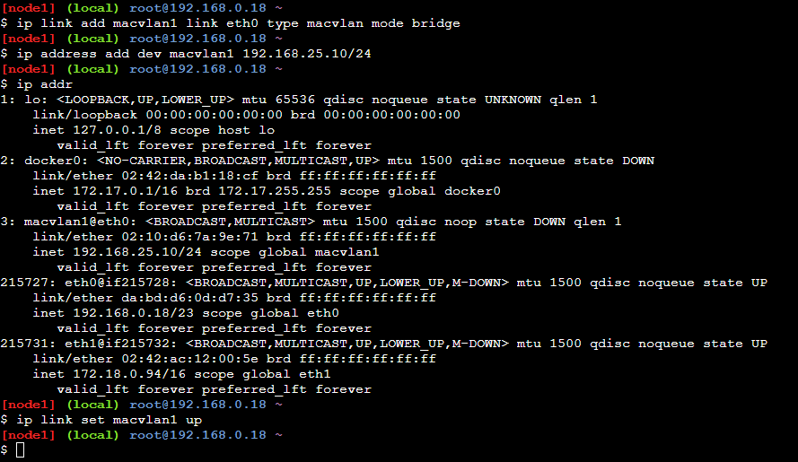
</p>

<p align="center">
  Создание адаптера и установка IP для Linux A
</p>

<!-------------------------------------------------------->

<p align="center">
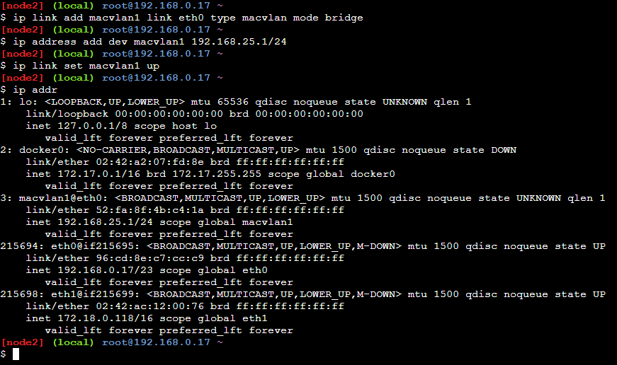
</p>

<p align="center">
  Создание адаптера и установка первого IP для Linux B
</p>

<!-------------------------------------------------------->

<p align="center">
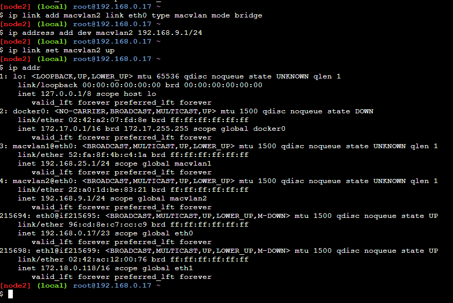
</p>

<p align="center">
  Создание адаптера и установка второго IP для Linux B 
</p>

<!-------------------------------------------------------->

<p align="center">
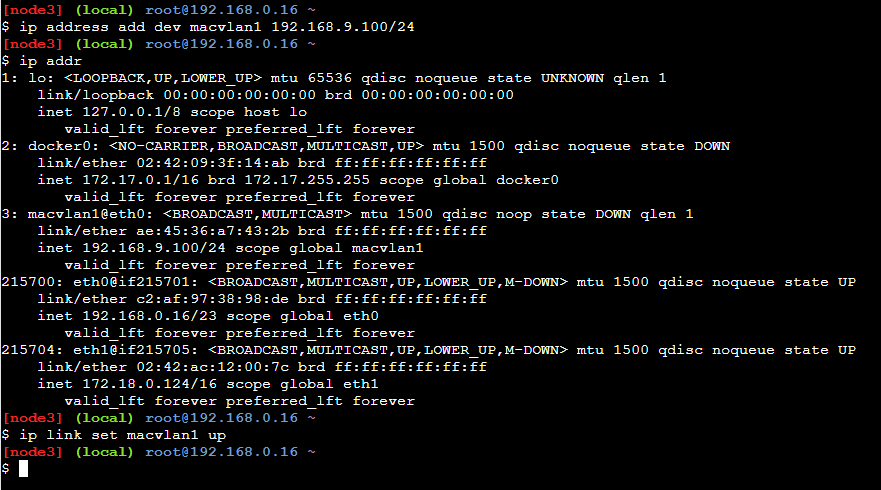
</p>

<p align="center">
  Создание 2-го адаптера и установка IP для Linux C 
</p>

<!-------------------------------------------------------->

 После настройки сети на ВМ необходимо прописать маршруты у клиентов А и С к их подсетям через машину В при помощи команды: `ip route add <subnet A vm>/<mask> via <gateway ip B vm>` 

<!-------------------------------------------------------->
<p align="center">
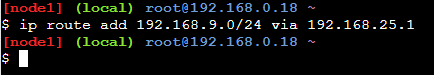
</p>

<p align="center">
  Настройка маршрута передачи от А к С через B 
</p>
<!-------------------------------------------------------->


<!-------------------------------------------------------->
<p align="center">
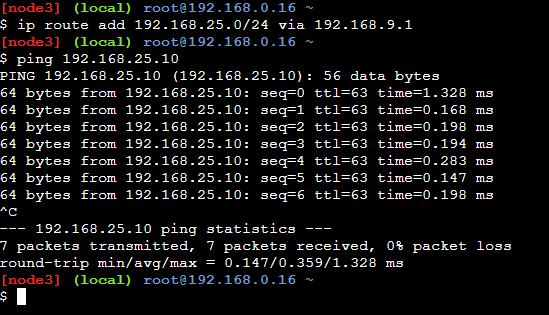
</p>

<p align="center">
  Настройка маршрута передачи от C к A через B
</p>
<!-------------------------------------------------------->

## Шаг 3: Настройка фаерволла 

На Linux B необходимо настроить файрвол таким образом, чтобы Linux B пропускал только http и только через порт 5000.

Это можно сделать при помощи tcpdump.

`apk add tcpdump`

`tcpdump -i any -s 0 'tcp port http' -w /tmp/http.cap and 'port 5000'`

<p align="center">
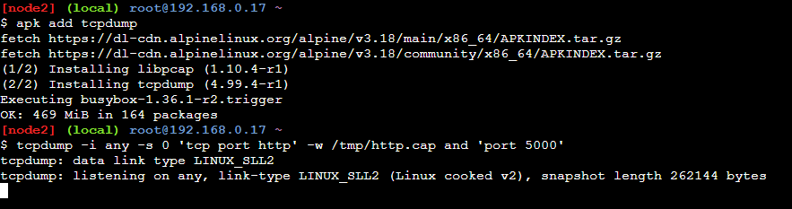
</p>

После этого, послав запрос с Linux A на Linux C, через порт, например, 8080, получим следующее:

<!-------------------------------------------------------->
<p align="center">
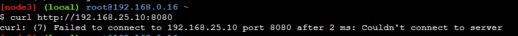
</p>

<p align="center">
  Запрос через порт, отличный от 5000
</p>
<!-------------------------------------------------------->


## Шаг 4: Организация клиент-серверного взаимодействия между А и С 

После настройки маршрутов необходимо развернуть сервер на А. Для этого нужно использовать библиотеку Flask

<!-------------------------------------------------------->
<p align="center">
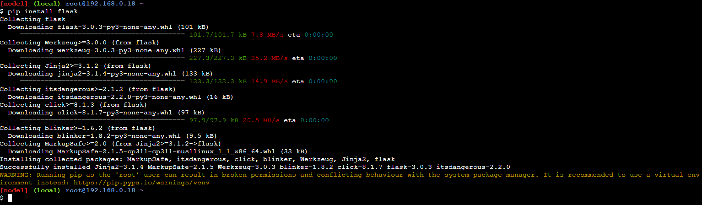
</p>

<p align="center">
  Установка Flask
</p>
<!-------------------------------------------------------->

Далее создаем файл app.py со следующим содержимым:

```py
from flask import Flask, request

app = Flask(__name__)

data = {"username":"", "password":""}

@app.route("/")
def get_():
    return data

@app.route("/",methods = ['POST'])
def post():
    data_json=request.get_json()
    if data_json is None:
        return 'Invalid JSON data', 400

    data['username']=data_json['username']
    data['password']=data_json['password']
    print(f"Data received {data_json}")

    return [data['username'], data['password']]

@app.route("/", methods =['PUT'])
def put():
    str = request.args.get('password')
    print(f"New password received {str}")
    data['password'] = str
    return [data['username'], data['password']]

app.run(host='0.0.0.0', port=5000)

EOF
```
Запущенный сервер выглядит так: 
<!-------------------------------------------------------->
<p align="center">
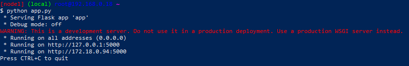
</p>

<p align="center">
  Сервер на машине А
</p>
<!-------------------------------------------------------->

<!-------------------------------------------------------->
<p align="center">
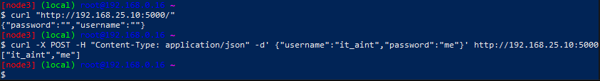
</p>

<p align="center">
  Ответ на отправленные запросы с машины С на А
</p>
<!-------------------------------------------------------->


<!-------------------------------------------------------->
<p align="center">
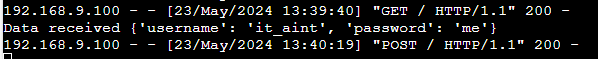
</p>

<p align="center">
  Запросы, пришедшие на сервер А
</p>
<!-------------------------------------------------------->

Для более упрощения работы с виртуальными машинами напишем три скрипта.

*Скрипт конфигурации виртуальной машины А*
```sh
#!/bin/bash
# Linux A
echo -e "Starting the MACVLAN installation\n"
ip link add macvlan1 link eth0 type macvlan mode bridge
ip address add dev macvlan1 192.168.25.10/24
ip link set macvlan1 up

echo -e "Ending the MACVLAN installation\n\n"

echo -e "Routing configuration FROM Linux A to Linux C \n\n"
ip route add 192.168.9.0/24 via 192.168.25.1

echo -e "Start to installing FLASK \n"
pip install flask
echo -e "End to installing FLASK \n\n"

echo -e "Creating web-server\n"
touch app.py
cat << EOF >app.py

from flask import Flask, request

app = Flask(__name__)

data = {"username":"", "password":""}

@app.route("/")
def get_():
    return data

# @app.route("/<number>", methods =['POST'])
# def post_(number):
#     return f"POST-request : {number}\n\n"

@app.route("/",methods = ['POST'])
def post():
    data_json=request.get_json()
    if data_json is None:
        return 'Invalid JSON data', 400

    data['username']=data_json['username']
    data['password']=data_json['password']
    print(f"Data received {data_json}")

    return [data['username'], data['password']]

@app.route("/", methods =['PUT'])
def put():
    str = request.args.get('password')
    print(f"New password received {str}")
    data['password'] = str
    return [data['username'], data['password']]

app.run(host='0.0.0.0', port=5000)

EOF

echo -e "Run the server\n"
python app.py
```
*Скрипт конфигурации виртуальной машины В*
```sh
#!/bin/bash
# Linux B

echo -e "Starting the first MACVLAN installation\n"
ip link add macvlan1 link eth0 type macvlan mode bridge
ip address add dev macvlan1 192.168.25.1/24
ip link set macvlan1 up
echo -e "Ending the first MACVLAN installation\n\n"

echo -e "Starting the second MACVLAN installation\n"
ip link add macvlan2 link eth0 type macvlan mode bridge
ip addres add dev macvlan2 192.168.9.1/24
ip link set macvlan2 up
echo -e "Ending the second MACVLAN installation\n\n"

echo -e "Installation tcpdump\n"
apk add tcpdump

echo -e "Configurate tcpdump (only http throw 5000 port)"

tcpdump -i any -s 0 'tcp port http' -w /tmp/http.cap and 'port 5000'
```
*Скрипт конфигурации виртуальной машины С*
```sh
#!/bin/bash
# Linux РЎ

echo -e "Starting the first MACVLAN installation\n"

ip link add macvlan1 link eth0 type macvlan mode bridge
ip address add dev macvlan1 192.168.9.100/24
ip link set macvlan1 up
ip route add 192.168.25.0/24 via 192.168.9.1

echo -e "Ending the first MACVLAN installation\n\n"

echo -e "Sending GET-request\n"
curl "http://192.168.25.10:5000/"


echo -e "Sending POST-request\n"
curl -X POST -H "Content-Type: application/json" -d' {"username":"it_aint","password":"me"}' http://192.168.25.10:5000

echo -e "\nChanging passwords \n"

curl -X PUT http://192.168.25.10:5000?password=senators_son

echo -e "Sending request to incorrect port\n"
curl http://192.168.25.10:8080
```

